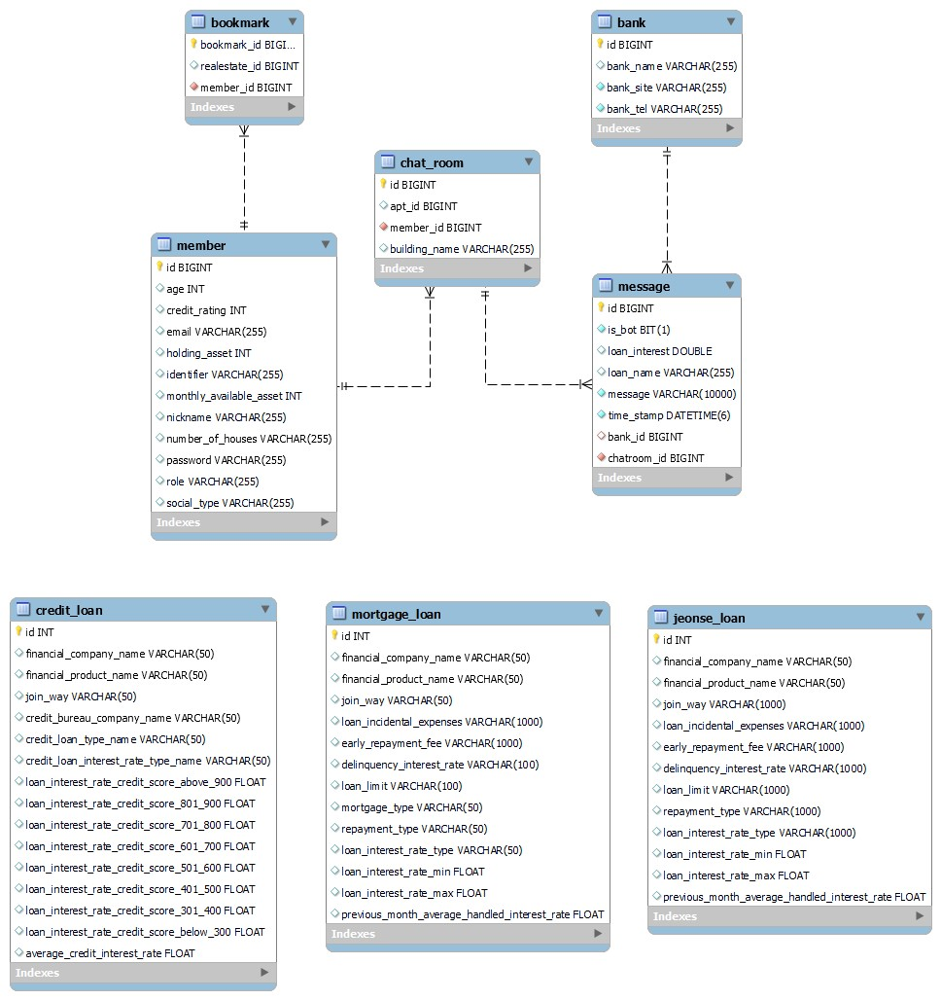
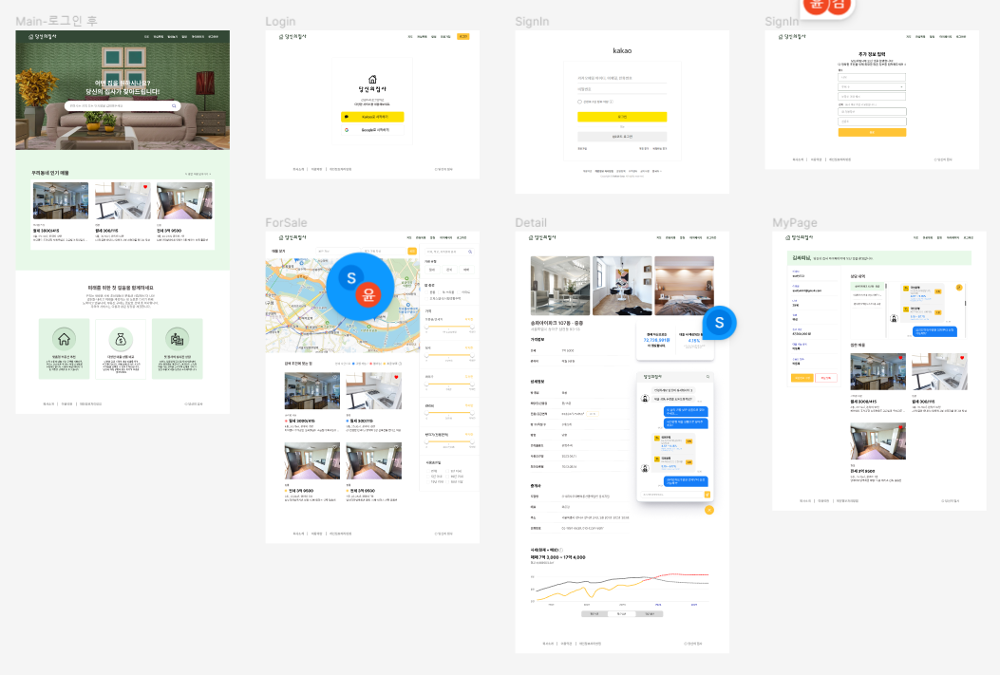
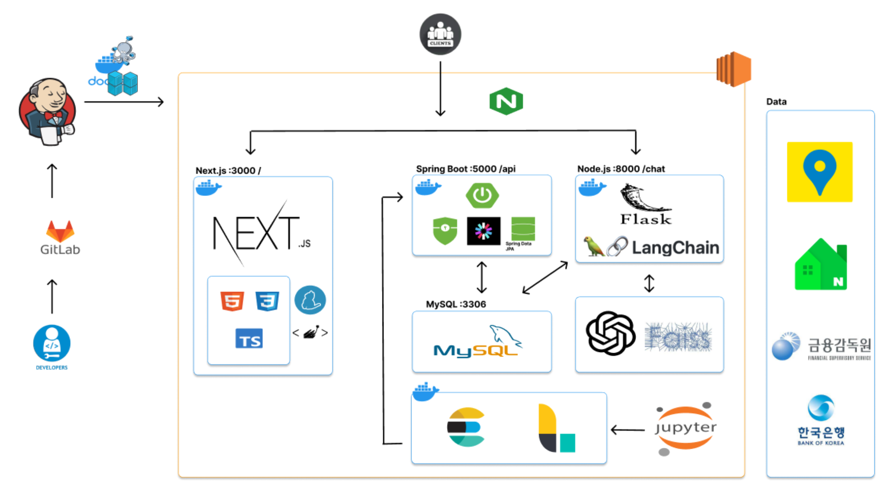
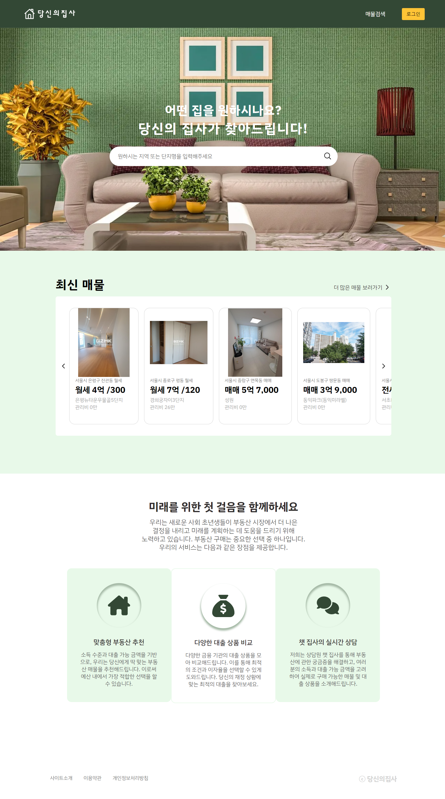
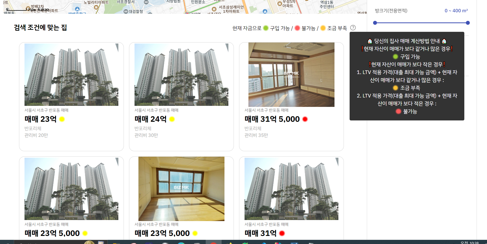
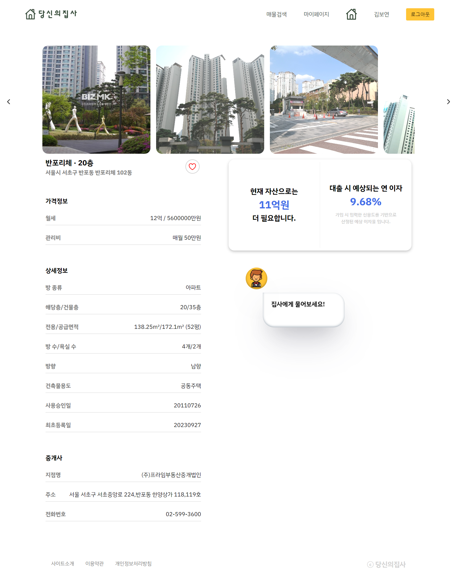
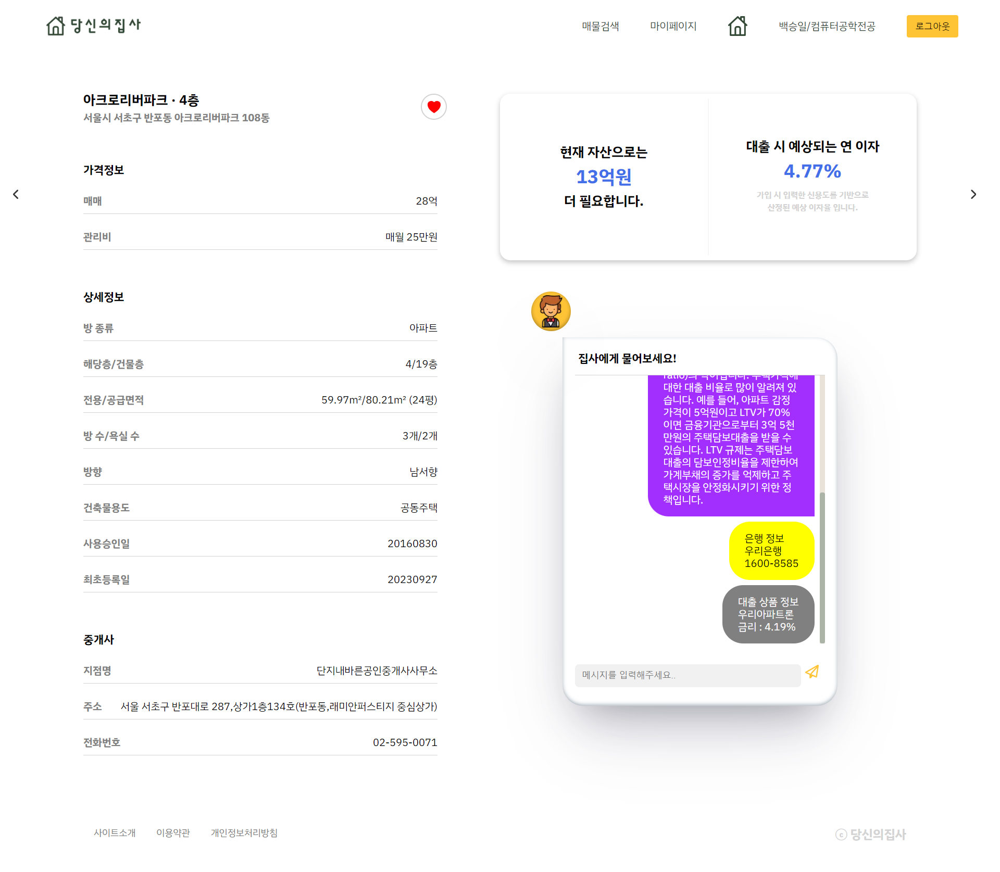
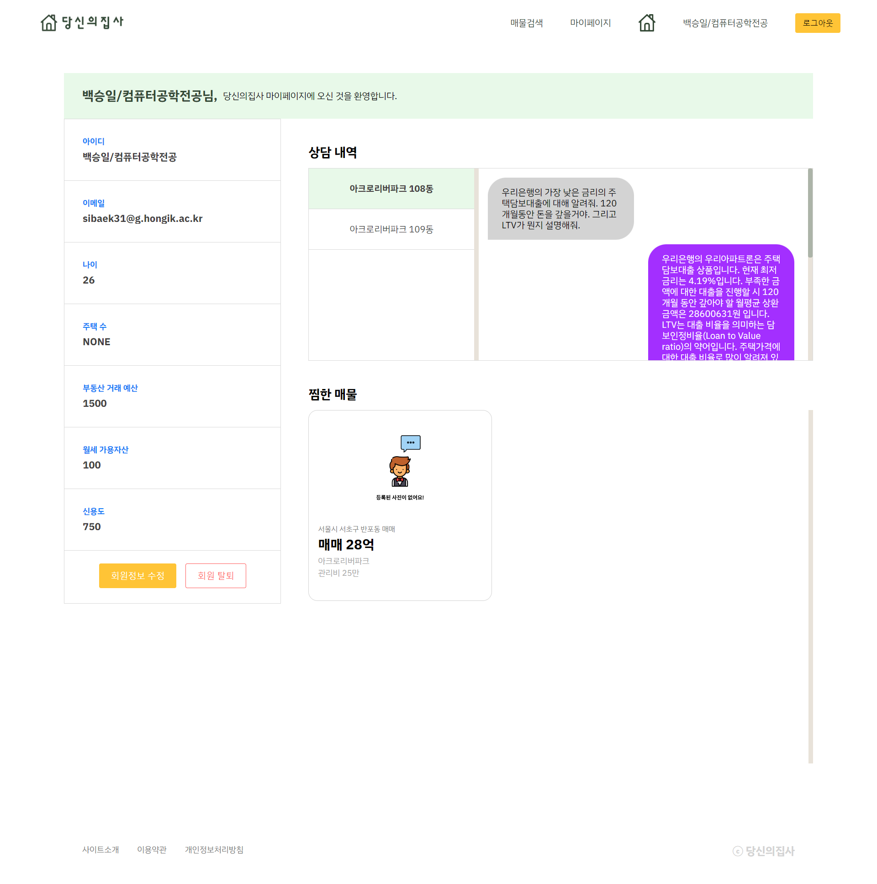
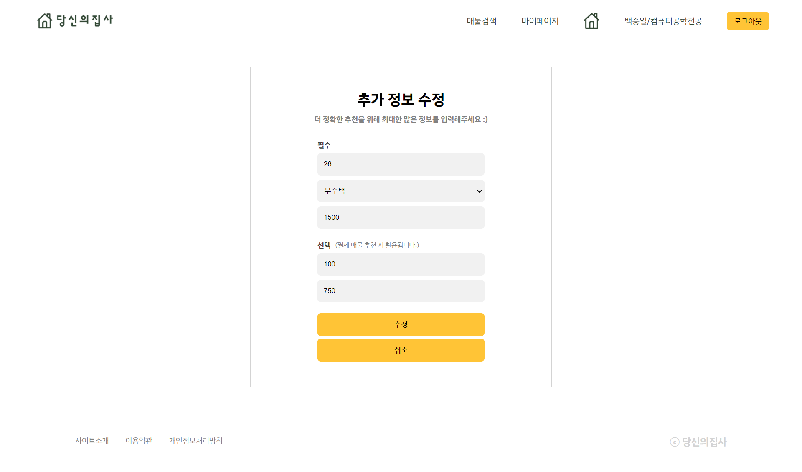

# 당신의집사

## 👩‍💻👨‍💻 팀원 소개

팀원 : 김보연, 박준홍, 백승일, 윤다정, 염순원

 
 

## 📅 프로젝트 기간

### 2023.08.28 ~ 2023.10.06 (6주)

- 기획 및 설계 : 2023.08.28 ~ 2023.09.01
- 프로젝트 구현 : 2023.09.04 ~ 2023.10.02
- 버그 수정 및 산출물 정리 : 2023.10.03 ~ 2023.10.06

 

 

## 💡 프로젝트 컨셉 및 주요 기능

### 당신의집사

> 부동산 거래가 어려운 사회초년생을 위한,
> 맞춤형 부동산 대출 추천 서비스

 

### 의도

- 부동산에 관심이 많고 대출이 어려운 2030 세대를 위한 서비스로, 당신이 집을 사라는 의미와 주인 곁에서 일을 도와주는 "집사"라는 중의적인 의미가 담겼습니다.

 

### 예상 사용자

- 월세, 전세, 매매 등 어떤 대출을 받아야 하는지 모르는 사용자
- 현재 내 정보로 대출은 받을 수 있을까? 대출에 대한 지식이 없는 사용자
- LTV, DSR 등.. 부동산 대출 관련 용어가 너무 어려운 사용자

 

### 주요 기능

- 대출 가능한 부동산 매물 가시화

  - 회원 정보(주택 수, 자산, 월 여유자금, 신용도 등), 지역, 매매/전세/월세, 등 검색 필터링

- AI 챗봇 상담 서비스
  - 은행의 신용평가모델을 통해서만 얻을 수 있기 때문에 평균적인 금액을 제시함으로써, 사용자들이 은행에 직접 방문하기 전, 부동산 거래와 대출을 받을 수 있는지 여부에 대해 예측이 가능하도록 정보를 제공합니다.
  - 금융 용어 사전 : 어려운 부동산 용어들에 대해 챗봇이 학습하고 있어서 해당 용어들에 대해서도 알기 쉽게 풀어줄 수 있습니다.

 
 

## 🛠️ 기술스택

### front

   

### back

     

### DB

### CI/CD

   

### 협업툴

   

 
 

## 🗃️ ERD

 

 

## 🎨 Figma

 

 

## 🗳️ API 명세서

[API 명세서 보러가기 (∩^o^)⊃━☆](exec/assets/api.pdf)

 
 

## 📂 프로젝트 구성

아키텍처

 
 

## 🖥 서비스 화면

### `메인 화면`

 

### `부동산 매물 검색`

 

### `부동산 매물 detail`

 

### `마이페이지`

 

## 📌 시연 시나리오

[당신의집사의 시연 보러가기 (☞ ﾟヮﾟ)☞](exec/assets/ucc.mp4)

 
 

## 📊 PPT 발표 자료

- 최종 발표 : [최종 발표 ppt자료 보러가기 (∩^o^)⊃━☆](exec/assets/finalppt.pdf)
